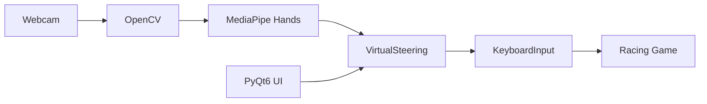

# Glove Shift

<p align="center">
  
</p>

<p align="center">
  Control racing games with hand gestures captured through your webcam.
</p>

<p>
  <a href="https://www.python.org/"></a>
  <a href="https://opencv.org/"></a>
  <a href="https://developers.google.com/mediapipe"></a>
  <a href="https://www.microsoft.com/windows"></a>
  <a href="LICENSE"></a>
  <a href="https://github.com/BUSHAAN/Glove-Shift/releases/latest"></a>
</p>

<p align="center">
  <a href="https://github.com/BUSHAAN/Glove-Shift/releases/latest"><strong>Download</strong></a>
  ·
  <a href="https://www.linkedin.com/posts/bushaangunatilake_racinggames-handgesturerecognition-computervision-activity-7187445360850616320-A-6p"><strong>Demo</strong></a>
  ·
  <a href="#installation"><strong>Installation</strong></a>
</p>

---

## Why Glove Shift?

Racing games are usually played with a keyboard, controller, or steering wheel.

Glove Shift explores a simpler idea: use a normal webcam as the controller. Hand gestures are detected in real time and translated into the same `W` `A` `S` `D` keys many racing games already use — no game mods, plugins, or custom integrations required.

---

## Features

**Real-time hand gesture control**  
Detects a left or right hand through the webcam and maps gestures to accelerate, brake/reverse, and steer left or right.

**Works with WASD racing games**  
Simulates keyboard input at the OS level, so any game that drives with `W` `A` `S` `D` can respond without special support.

**Webcam-only setup**  
No gloves, tracking hardware, or external controllers — just a camera and Windows.

**Simple desktop UI**  
A small PyQt6 window starts and stops the steering loop, with a live OpenCV preview of the tracked hand. Choose **Either hand** (default), left only, or right only.

**Adjustable sensitivity**  
Steering sensitivity and smoothing sliders in the app tune how quickly tilt turns engage and how stable gesture-to-key mapping feels. Settings are saved locally.

**Custom key mapping**  
Remap accelerate / brake / left / right from WASD to arrows or other keys without editing code.

**In-app gesture guide**  
`Gesture_Controls_New.png` is shown in the main window so you can check poses without opening the README.

**Windows installer and portable build**  
Download a setup package or a standalone portable EXE from [Releases](https://github.com/BUSHAAN/Glove-Shift/releases/latest) — no Python install needed for end users.

---

## Demo

Watch Glove Shift controlling a racing game with hand gestures:

**[▶ Demo on LinkedIn](https://www.linkedin.com/posts/bushaangunatilake_racinggames-handgesturerecognition-computervision-activity-7187445360850616320-A-6p)**

Gesture reference (mirror the same poses for the left hand):

<p align="center">
  
</p>

| Gesture idea | Keys |
| --- | --- |
| Accelerate | `W` |
| Brake / reverse | `S` |
| Steer left / right | `A` / `D` |
| Combined (e.g. accelerate + left) | `W` + `A`, and similar pairs |

> **Note:** Default hand mode is **Either hand**. You can lock to left or right in the app.

---

## How it works

```text
Webcam
   ↓
OpenCV frame capture
   ↓
MediaPipe hand landmarks
   ↓
Gesture recognition (finger / tilt rules)
   ↓
Control mapping → W A S D
   ↓
Windows keyboard input (SendInput)
   ↓
Racing game
```

1. **Capture** — OpenCV reads webcam frames and shows a live preview with FPS.
2. **Detect** — MediaPipe Hands finds 21 landmarks on a single hand.
3. **Recognize** — Landmark geometry decides accelerate, brake, or neutral, plus left/right tilt for steering.
4. **Inject** — `KeyboardInput` presses and releases `W` `A` `S` `D` through the Windows `SendInput` API.
5. **Play** — The focused racing game receives those keys like a normal keyboard.

---

## Architecture



| Module | Role |
| --- | --- |
| `app.py` | PyQt6 entry point — start/stop steering, camera check |
| `VirtualSteering.py` | Frame loop, landmark rules, key mapping |
| `HandTrackingModule.py` | MediaPipe wrapper for detection and landmark lists |
| `KeyboardInput.py` | Low-level `W` `A` `S` `D` press/release via `ctypes` / `SendInput` |

---

## Installation

### Requirements

- Windows 10/11
- Webcam
- For the packaged app: Visual C++ Redistributable 2015–2022 if the EXE fails to start (bundled with the installer zip on the release)

### Option 1 — Installer (recommended)

1. Download **`GloveShift.Setup.1.0.0.zip`** from [Releases](https://github.com/BUSHAAN/Glove-Shift/releases/latest).
2. Extract and run the setup EXE.
3. Launch **Glove Shift** and click **Start Steering!**
4. Open a racing game and map driving to `W` (accelerate), `A` (left), `S` (brake/reverse), `D` (right) if needed.
5. Keep the game focused and use either hand in front of the camera (or lock left/right in the UI).

### Option 2 — Portable

1. Download **`GloveShift.Portable.exe.zip`** from [Releases](https://github.com/BUSHAAN/Glove-Shift/releases/latest).
2. Extract and run the EXE — no installer, no Start Menu entry, no uninstaller.

> Windows SmartScreen may warn on unsigned builds. Choose **More info → Run anyway** if you trust the download. Checksums are in `SHA256SUMS.txt` on the release.

---

## Run from source

For development (Python **3.10+**; 3.11–3.14 tested with current MediaPipe Tasks API):

```bash
git clone https://github.com/BUSHAAN/Glove-Shift.git
cd Glove-Shift

python -m venv venv
venv\Scripts\activate          # Windows

pip install -r requirements.txt
python app.py
```

The hand tracker needs `models/hand_landmarker.task` (included in the repo). If it is missing, download it from [MediaPipe Hand Landmarker](https://developers.google.com/mediapipe/solutions/vision/hand_landmarker) and place it under `models/`.

---

## Build from source

To produce a standalone EXE and Windows installer (PyInstaller + Inno Setup):

See **[README-BUILD.md](README-BUILD.md)**.

---

## Project layout

```text
Glove-Shift/
├── app.py                  # PyQt6 UI entry point
├── VirtualSteering.py      # Gesture → WASD loop
├── HandTrackingModule.py   # MediaPipe Hand Landmarker (Tasks API)
├── KeyboardInput.py        # Windows SendInput helpers
├── settings.py             # Load/save sensitivity (settings.json)
├── models/
│   └── hand_landmarker.task
├── images/
│   ├── Gesture_Controls_New.png
│   ├── logo.png
│   ├── icon.png
│   └── icon.ico
├── Installer/              # Inno Setup packaging
├── requirements.txt
└── README-BUILD.md
```

---

## Tech stack

| Layer | Tools |
| --- | --- |
| Language | Python 3 |
| Vision | OpenCV, MediaPipe Hand Landmarker (Tasks API) |
| UI | PyQt6 |
| Input | Windows `SendInput` (`ctypes`) |
| Packaging | PyInstaller, Inno Setup |

---

## Limitations

- **Windows only** for keyboard injection (`SendInput`).
- Games must accept **keyboard** `W` `A` `S` `D` (or be remappable to those keys).
- Lighting, camera angle, and hand pose affect recognition quality.

---

## Contributing

Contributions are welcome.

**Useful areas**

- Gesture accuracy and stability
- PyQt6 UI / error handling
- Packaging and build docs
- Cross-platform input (today’s keyboard layer is Windows-specific)

**Workflow**

1. Fork the repo and create a branch.
2. Make focused changes and test with `python app.py`.
3. Open a pull request with a short description of what changed and why.

For larger ideas, open an issue first.

---

## License

Released under the [MIT License](LICENSE).
